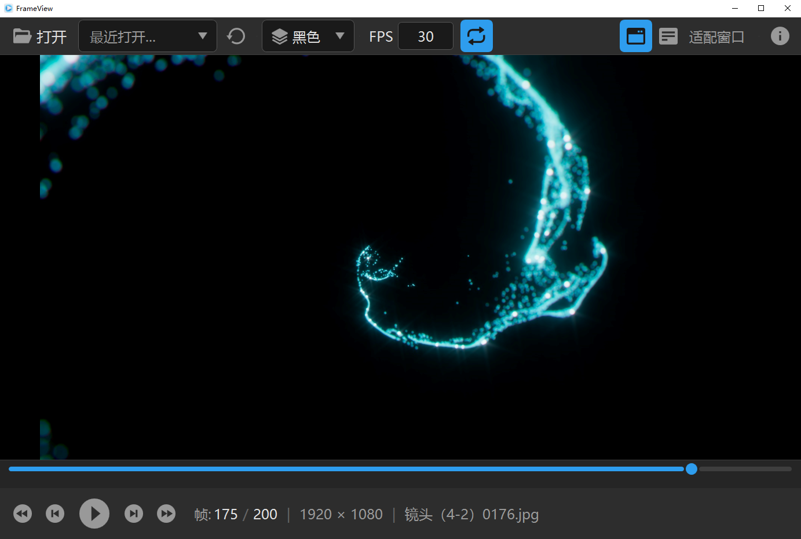

<picture>
  <source media="(prefers-color-scheme: dark)" srcset="AppIcon.png">
  
</picture>

# FrameView

**A lightweight Windows desktop application for previewing image sequence animations.**

FrameView lets you open a folder of sequentially numbered frames (PNG, JPG, WebP, BMP) and play them back as an animation — with full playback controls, zoom and pan, and a dark-themed UI optimized for game development and visual effects workflows.

[中文文档](README_CN.md)

---

## Screenshot



---

## Features

- **Open folder / Drag & drop**: Open any folder containing sequenced images to instantly preview the animation
- **Auto-scan & natural sort**: Automatically detects and sorts frame sequences with natural number ordering
- **Playback controls**: Play / Pause / Previous Frame / Next Frame / First Frame / Last Frame
- **Adjustable FPS**: 1–120 FPS (default 24 FPS)
- **Loop playback**: Toggle looping on or off
- **Timeline scrubbing**: Drag the timeline slider to jump to any frame
- **Canvas navigation**: Mouse wheel zoom / Mouse drag pan
- **Fit window / Original size**: One-click viewport fitting or 1:1 pixel display
- **Alpha background modes**: Checkered, Black, White, or Gray backgrounds for transparency inspection
- **Frame cache & preload**: LRU caching strategy for smooth playback
- **Auto-reload on changes**: Watches the folder and reloads when files are added, removed, or modified
- **Recent folders**: Remembers recently opened folders
- **Keyboard shortcuts**: Full keyboard navigation
- **Dark theme**: Eye-friendly dark UI throughout

---

## Usage

1. Click **Open Folder** or drag a folder onto the window
2. Click **▶** to start playback
3. Scroll to zoom, drag to pan

### Keyboard Shortcuts

| Key | Action |
|---|---|
| Space | Play / Pause |
| ← → | Previous / Next frame |
| Home / End | First / Last frame |
| Ctrl+O | Open folder |
| Ctrl+R | Reload frames |
| F | Fit to window |
| 1 | Original size (100%) |

---

## System Requirements

- **OS**: Windows 7 or later (x64)
- **Runtime**: .NET 7 Runtime *(not required for self-contained builds)*

---

## Installation

### Option 1 — Installer (Recommended)

Download the latest `FrameView_Setup_v1.1.0.exe` from the [Releases](../../releases) page and run the installer.

### Option 2 — Self-contained (Portable)

Download the self-contained `publish-selfcontained` build. No .NET Runtime required — just unzip and run `SequenceFrameViewer.exe`.

### Option 3 — Framework-dependent (Minimal)

If .NET 7 Runtime is already installed, use the framework-dependent `publish` build (~1 MB).

---

## Build from Source

### Prerequisites

- [.NET 7 SDK](https://dotnet.microsoft.com/en-us/download/dotnet/7.0)
- Windows OS (WPF dependency)

```powershell
# Build (Debug)
dotnet build

# Build (Release)
dotnet build -c Release

# Publish — framework-dependent (~1 MB, requires .NET 7 Runtime)
dotnet publish -c Release -o publish

# Publish — self-contained single file (~153 MB, zero dependencies)
dotnet publish -c Release --self-contained -r win-x64 `
  -p:PublishSingleFile=true -p:IncludeNativeLibrariesForSelfExtract=true `
  -p:DebugType=none -p:DebugSymbols=false -o publish-selfcontained
```

### Build Installer

After publishing the self-contained build, run the Inno Setup script:

```powershell
ISCC.exe setup.iss
```

Requires [Inno Setup 6](https://jrsoftware.org/isdl.php).

---

## Tech Stack

| Layer | Technology |
|---|---|
| Language | C# |
| Framework | .NET 7 (WPF + Windows Forms) |
| Architecture | MVVM |
| MVVM Toolkit | CommunityToolkit.Mvvm 8.2.2 |
| Image Decoding | Windows Imaging Component (WIC), native |
| UI | XAML, dark theme |
| Installer | Inno Setup 6 |

---

## License

[MIT](../LICENSE)
